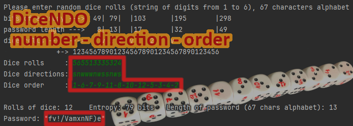

# `DiceNDO` dice-based password generator


# Overview

DiceNDO is a small, auditable Python script that generates strong passwords
from physical randomness produced by dice rolls. Unlike typical random
password generators that rely on hardware and operating system random seeds,
which need additional effort for true randomness, DiceNDO lets you create
entropy offline through a process you can provide by your own hand and observe
its results.

The core idea is simple: you roll a set of dice, record three independent
pieces of information, and DiceNDO deterministically converts that information
into a password using a fixed alphabet.

The script is intentionally minimal and avoids external dependencies beyond
Python’s standard library (`math` and `re`) to make code review easy.

# Table of contents

* Overview
* Repository contents
* Concept
  * Why dice are a good entropy source
  * Why three entropy sources are better than one
* How it works (algorithm)
* How to use
* Preparing dice for full functionality (rolls + direction + order)
* Entropy considerations
* Implementation notes
* FAQ
* License (short GNU notice)

# Repository contents

This repository contains two scripts:

1. `dicendo.py` (current)
* Generates passwords using three independent entropy sources from dice:
  * the rolled faces (pips)
  * the orientation/direction of each die after aligning the dice in a line
    (`N`/`E`/`S`/`W`)
  * the order of dice (a permutation index)

2. `dicen.py` (legacy)
* An older and simpler generator that uses only the rolled faces (pips) as the entropy source.

# Concept

## Why dice are a good entropy source

Dice provide physical randomness that is:

* offline - no computer or network required to generate entropy
* observable - you can see the result and record it
* easy to scale - use more dice to increase the entropy

A properly executed dice roll is a practical way to obtain entropy for secrets
such as passwords, passphrases, or - with appropriate encoding - cryptographic
keys.

## Why three entropy sources are better than one

Even best gaming dice is imprefect, after all no physical object is as perfect
as its mathematical model. In standard board games pips are carved and filled,
changing mass distribution. That may introduce small statistical deviations in
rolled face frequencies.

DiceNDO improves robustness by combining three different entropy sources:
* rolled faces - `6` possibilities per die
* orientation/direction - `4` possibilities per die, if you can reliably
  label/observe direction
* order of dice - all permutations, i.e., `N!` possibilities for `N` dice

Even if the dice faces are somewhat biased, predicting the final directions and
the final order after mixing and aligning is practically infeasible. In effect,
only a small portion of the "raw bits" may be imperfect, but the overall result
remains strong for real-world use. For extremely cautious users, you can use
casino-grade dice, which are manufactured with very tight tolerances.

# How it works (algorithm)

DiceNDO converts your inputs into a single large integer and then converts that
integer into a password using a fixed alphabet:

Alphabet used for passwords is `abcdefghijkmnopqrstuvwxyzABCDEFGHJKLMNPQRSTUVWXYZ23456789!@#$%&()/?`.

Steps:

1. Order/permutation --> integer
* The dice order is provided as a permutation of `1..N`.
* DiceNDO computes the index of that permutation using the Lehmer ranking
  method.
* This gives an random integer in `[0, N! - 1]` range.

2. Rolled faces --> base-6 accumulation
* The sequence of faces is processed as digits in base `6` using a simple loop:
  * each new roll multiplies the running number by `6`
  * then adds the current digit mapped via modulo `6` (so `6` becomes `0`)

3. Directions --> base-4 accumulation
* Directions are mapped to `0..3` number
* Then processed similarly, multiply by 4, add digit (modulo 4)

4. Integer --> password (base-|alphabet|)
* The final integer is converted to base 67 (i.e. `len(ALPHABET)`).
* The script outputs a fixed number of characters derived from the effective
  entropy.

# How to use

Run:

```
python3 dicendo.py
```

The program is interactive and repeats until you enter an empty string as the
first input.

You will be prompted for:

1. Dice rolls
* A continuous string of digits `1..6`
* Example: `564651234564`

2. Directions
* A continuous string of letters `n`, `e`, `s`, `w` (case-insensitive) or
  digits `0..3`
* Example: `wewsnswenwns`

3. Order
* A permutation of `1..N` where `N` is the number of dice. You should separate
  numbers with spaces or characters such as `. , -`
* Example: `5-6-4-1-2-3-12-11-9-10-7-8`

Output:
* the generated password
* estimated entropy in bits

# Preparing dice for full functionality (rolls + direction + order)

To use all available entropy sources (rolls + direction + order), you should
prepare a set of dice so that each die is uniquely identifiable and its
orientation is visible.

Suggested approach:
* Buy plain 12-dices set of white dice.
* Using a permanent marker, label each die so it can be identified as die #1,
  #2, ..., #12.
  * Write the die number on each face, so the number and direction is visible
    regardless of which face is up.
* Also ensure you can determine orientation:
  * mark a consistent "north" edge or corner and define how you read `N`/`E`/`S`/`W`
    after placing dice in a line.

When throwing:
* Mix the dice well, but don't overdo it, because with significant rolling,
  gyroscopic effects start to come into play, which can amplify the bias
  resulting from small dice imbalances.
* Throw them.
* Without sorting or "fixing" the order, gently align them into one line (for
  example, by pushing them with a ruler) to make reading easier.

# Number of dice

DiceNDO works with any number of dice. However, this documentation assumes `12`
dice because that’s a common set size for tabletop players.

# Entropy considerations

For `N` dice, with:
* rolls: `6` possibilities per die
* directions: `4` possibilities per die
* order: `N!` possibilities
total outcome count is `N! * 6^N * 4^N`. So for `12` dice it is
`17493304854426997594521600` possible passwords (~1.7 * 10^25), that is 79 bits
of entropy.

Why this matters:
* This keeps the password length aligned with the amount of physical randomness
  you actually produced.
* It avoids "stretching" limited entropy into a longer password that only looks
  stronger.

Note on bias:
* Standard dice can be slightly unbalanced.
* Even so, direction and order are extremely hard to predict, so combining all
  three sources helps protect against small face biases.
* If you want to reduce concerns further, consider casino dice. On some
  platforms it is possible to buy original dice withdrawn from casinos. These
  dices are scrapped, but their quality still arouses admiration.

# Implementation notes

The implementation is intentionally straightforward:
* compute the Lehmer rank of the permutation (dice order)
* extend the number by folding in each roll in base `6`
* extend the number again by folding in each direction in base `4`
* convert the final integer into a fixed-length representation using the
  password alphabet

Only Python standard library modules are used (`math` and `re`), to keep the
script simple to audit and easy to run anywhere.

# FAQ

## The password sometimes doesn’t contain "required characters", is algorithm broken?

No. The output is truly random over the chosen alphabet, so sometimes a class
of characters will not appear. That’s normal.

For example, what is the probability that a 12-character password drawn
uniformly from an alphabet of 67 symbols contains no digits, if there are 8
digits in that alphabet?

Let total alphabet size if `67` (containing `59` non-digit characters and `8`
digit characters) and password length is `12`. Then probability of nodigits
password is `(59/67)^12`. Numerically, this is about `22%`. This is not a bug,
it’s simply how random sampling works.

If a system enforces strict composition rules, you have a few options:
* generate a new password
* increase the length - more draws --> lower chance of missing a category
* just add one requested character at the end

# License

Copyright (C) 2021-2026 [Rafał Czeczótka](mailto:rafal_dot_czeczotka_at_gmail_dot_com)

This program is free software: you can redistribute it and/or modify it under
the terms of the GNU Affero General Public License as published by the Free
Software Foundation, either version 3 of the License, or (at your option) any
later version.

This program is distributed in the hope that it will be useful, WITHOUT ANY
WARRANTY; without even the implied warranty of MERCHANTABILITY or FITNESS FOR A
PARTICULAR PURPOSE. See the GNU Affero General Public License for more details.

You should have received a copy of the GNU Affero General Public License along
with this program. If not, see
[https://www.gnu.org/licenses/](https://www.gnu.org/licenses/).
